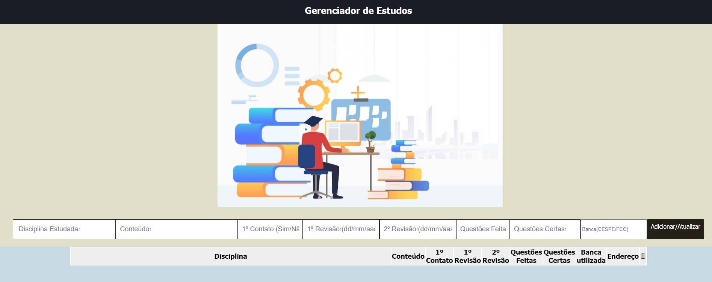
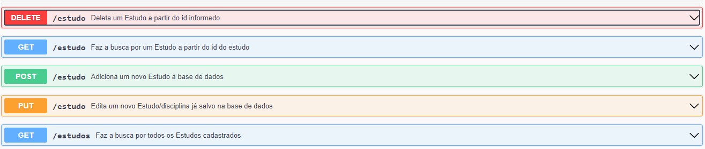

# Front-end (HTML/JS/CSS)

Este  projeto faz parte da entrega do MVP da Disciplina **Sprint Desenvolvimento Back-End Avançado** .

O objetivo aqui é colocar em prática o conteúdo apresentado ao longo das aulas com o desenvolvimento de um back-end e de um front-end.

Escolhi implementar um Gerenciador de Estudo que tem como objetivo fazer o controle (CRUD) de determinadas disciplinas que desejo realizar um estudo para vários tipos de propósito:
concurso, vestibular, estudo de línguas, etc.Aqui o foco foi o estudo para concurso como exemplo.

---
## Como executar

Basta fazer o download do projeto e abrir o arquivo index.html no seu browser.Aqui se considera executar o index.html localmente sem docker.

Ao carregar o arquivo index.html será visto no browser a página do Front do Gerenciador de Estudo abaixo:



---
## Como executar através do Docker

Certifique-se de ter o [Docker](https://docs.docker.com/engine/install/) instalado e em execução em sua máquina.


Navegue até o diretório que contém o Dockerfile e o requirements.txt no terminal.
Execute **como administrador** o seguinte comando para construir a imagem Docker:

```
$ docker build -t front .
```

Uma vez criada a imagem, para executar o container basta executar, **como administrador**, seguinte o comando:

```
$ docker run --rm -p 8080:80 front 
 ou docker run -d -p 8080:80 front
```
### Alguns comandos úteis do Docker

>**Para verificar se a imagem foi criada** você pode executar o seguinte comando:
>
>```
>$ docker images
>```
>
> Caso queira **remover uma imagem**, basta executar o comando:
>```
>$ docker rmi <IMAGE ID>
>```
>Subistituindo o `IMAGE ID` pelo código da imagem
>
>**Para verificar se o container está em exceução** você pode executar o seguinte comando:
>
>```
>$ docker container ls --all
>```
>
> Caso queira **parar um conatiner**, basta executar o comando:
>```
>$ docker stop <CONTAINER ID>
>```
>Subistituindo o `CONTAINER ID` pelo ID do conatiner
>
>
> Caso queira **destruir um conatiner**, basta executar o comando:
>```
>$ docker rm <CONTAINER ID>
>```
>Para mais comandos, veja a [documentação do docker](https://docs.docker.com/engine/reference/run/).

>Para acessa utilize a url  [http://localhost:8080/](http://localhost:8080/) no seu navegador.

## API externa utilizada

>Uso a seguinte api externa: 
>https://viacep.com.br/ 


## Acessando o serviço de CEP

>Para acessar o webservice, um CEP no formato de {8} dígitos deve ser fornecido, por exemplo: "01001000".
>Após o CEP, deve ser fornecido o tipo de retorno desejado, que deve ser "json" ou "xml". No contexto da aplicação foi utilizar esse serviço para obter o endereço de um Banca Examinadora na qual um estudante está
se dedicando a mesma para um concurso.

>Exemplo de pesquisa por CEP:
>
>viacep.com.br/ws/01001000/json/ (rota utilizada com verbo get)

## Rotas que o Front faz comunicação (Componente C)


